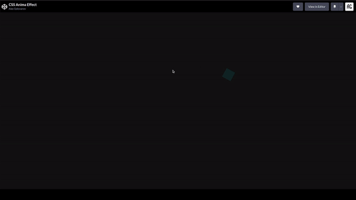

# CSS Animation Effect

### Use Skills

---

[Demo Link  ](https://codepen.io/AlexGolovanov/pen/poaYgKL)

## Info

Создано на основе видео с Youtube канала [Online Tutorials](https://www.youtube.com/c/OnlineTutorials4Designers). 

Для обучения и отработки работы **CSS** и **JavaScript**.  
Появление эффектов при движение курсора.   
Возможность замены бэкграунда для изменения вида эффекта.

---

## Contacts

- 📧 My Email: <a href="mailto:golovanov.a.a@yandex.ru" >Golovanov.a.a@yandex.ru</a>
- 📜 My Website: [alexgolovanov.ru](http://alexgolovanov.ru)

 Made with 💙
